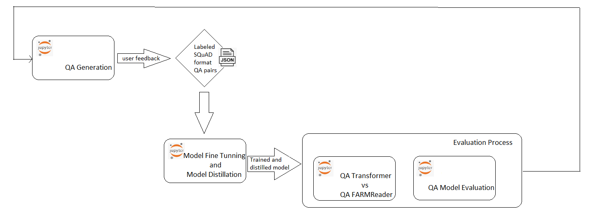

# QA Evaluation process

Evaluation pipelines are based on the popular SQuAD format. To generate these
files we can use the /feedback endpoint of the NLPService.

EEA Subject Matter Experts or other appropriate users give their feedback on
the generated (question, answer) pairs and this way it is obtained a ``SQuAD
formatted json`` file that can be used for creating the EEA specific trained
model.

## Finetuning and model distilation

The creation of the, EEA specific, trained model, will be done by using
**QAFineTuning** (*QAFineTuning.ipynb*) notebook created based on the tutorial
from https://haystack.deepset.ai/docs/latest/tutorial2md .
First the model will be fine tuned, then the fined tuned model will be
distilled.

## Evaluating models

**QA Transformers vs QA FARMReader** *(QA Transformers vs QA FARMReader.ipynb)*
notebook can be used to compare different ``QA models`` (e.g.
deepset/minilm-uncased-squad2, deepset/roberta-base-squad2, etc.), working both
with ``Transformer Reader`` and with ``FARMReader Reader``.

In comparison,  ``FARMReader`` is used as reference Reader and
``deepset/roberta-base-squad2`` as reference model.

The comparison is done on speed and on accuracy.

After the creation of the EEA specific trained model, it will be able to also
compare it with the other existing models.

Also, for evaluation purposes, the **QA Model Evaluation** notebook
(*QAModelEvaluator.ipynb*) can be used. This notebook was created based on the
tutorial from https://haystack.deepset.ai/docs/latest/tutorial5md .

## Question generation

**QA Generation** *(QuestionAnswersGeneration.ipynb)* notebook generates a json
in ``SQuAD`` format, containing (question, answer) pairs based on ``EEA``
documents.
